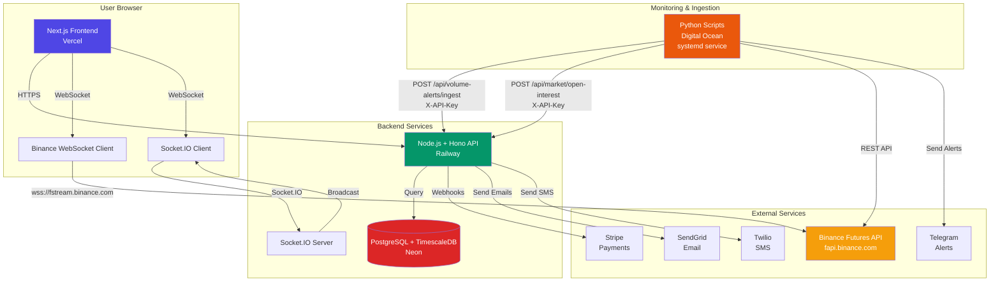
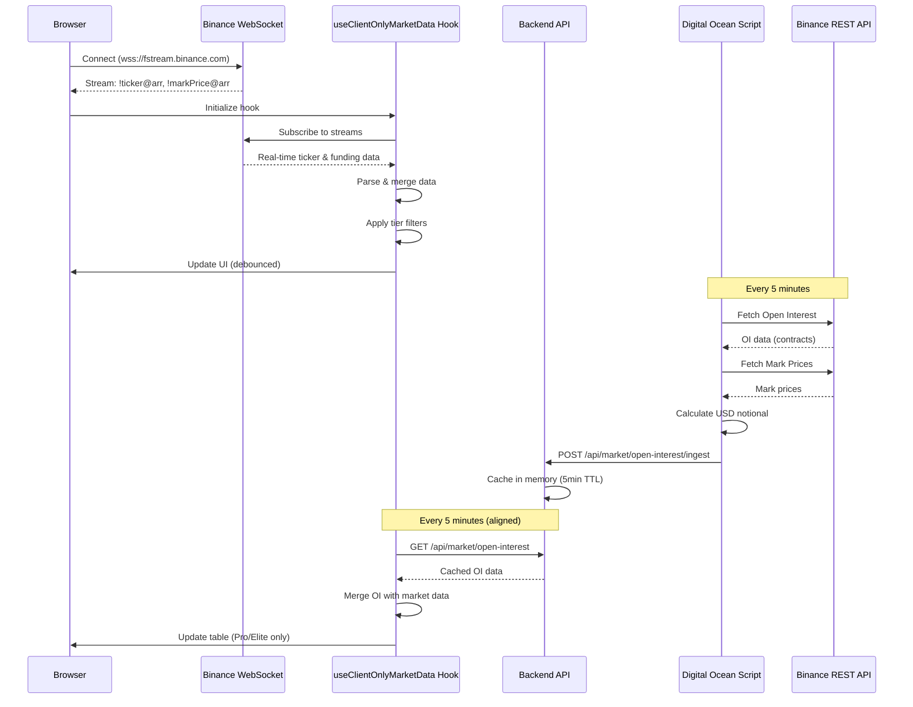
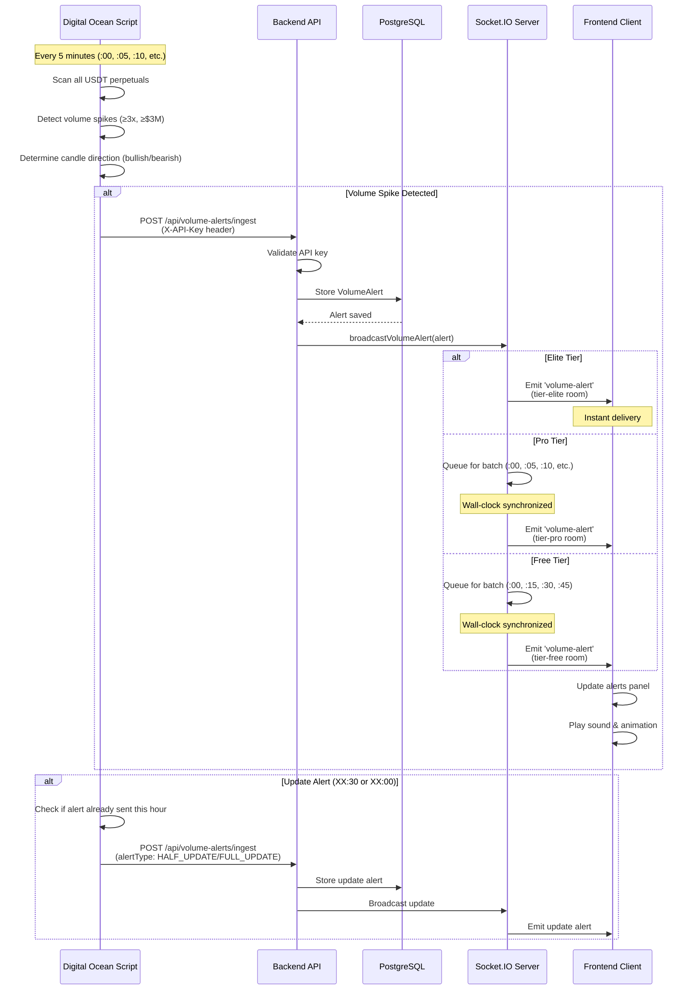
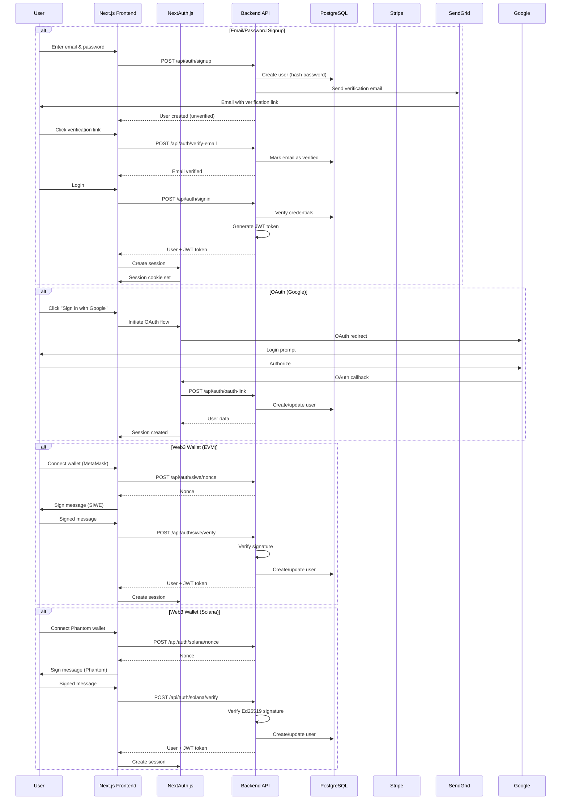
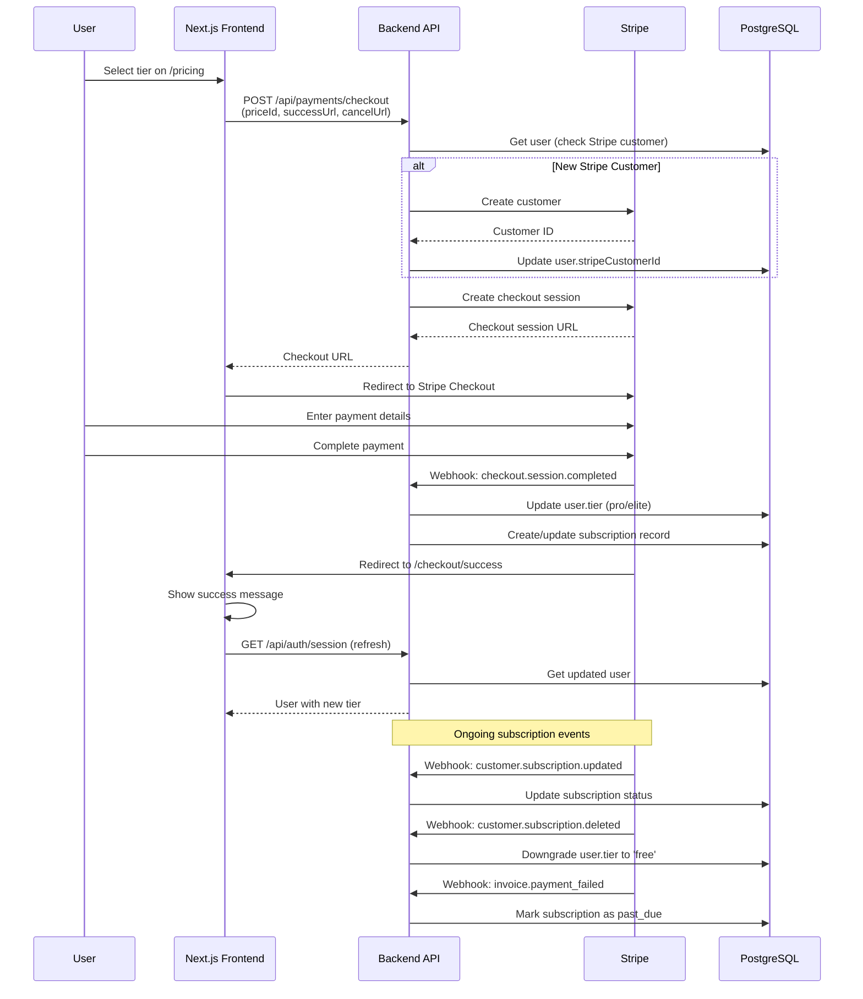
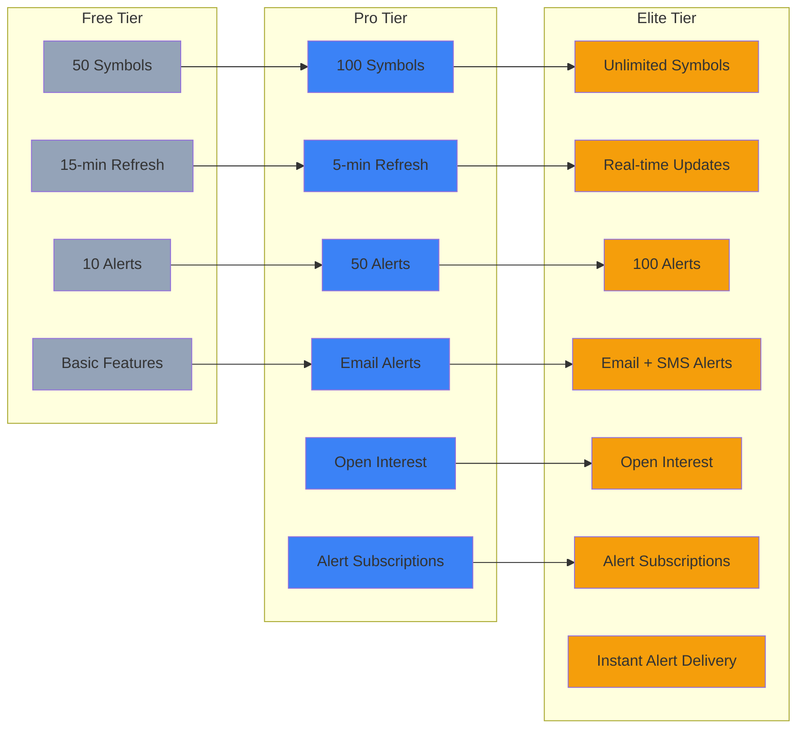
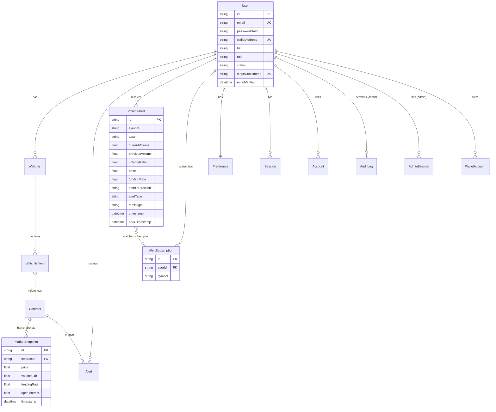
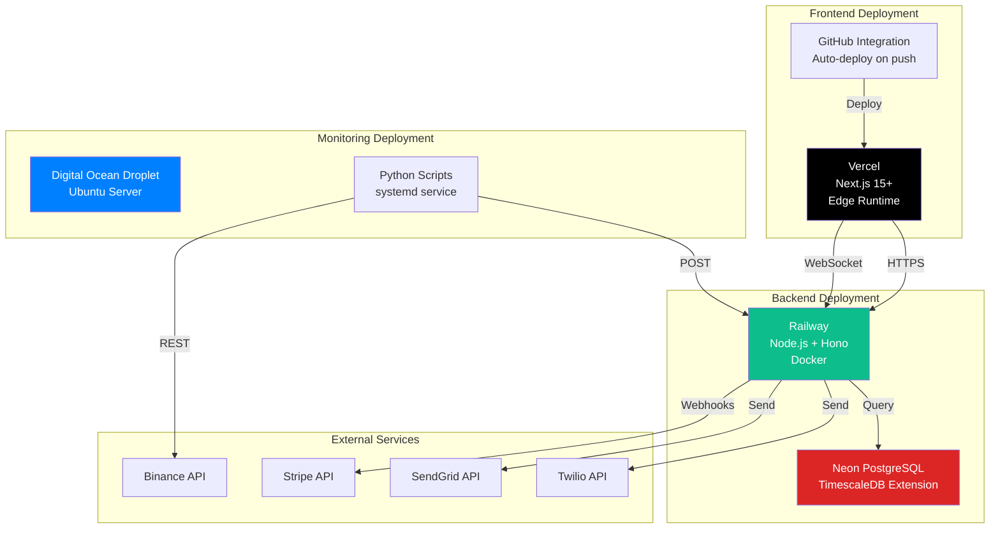
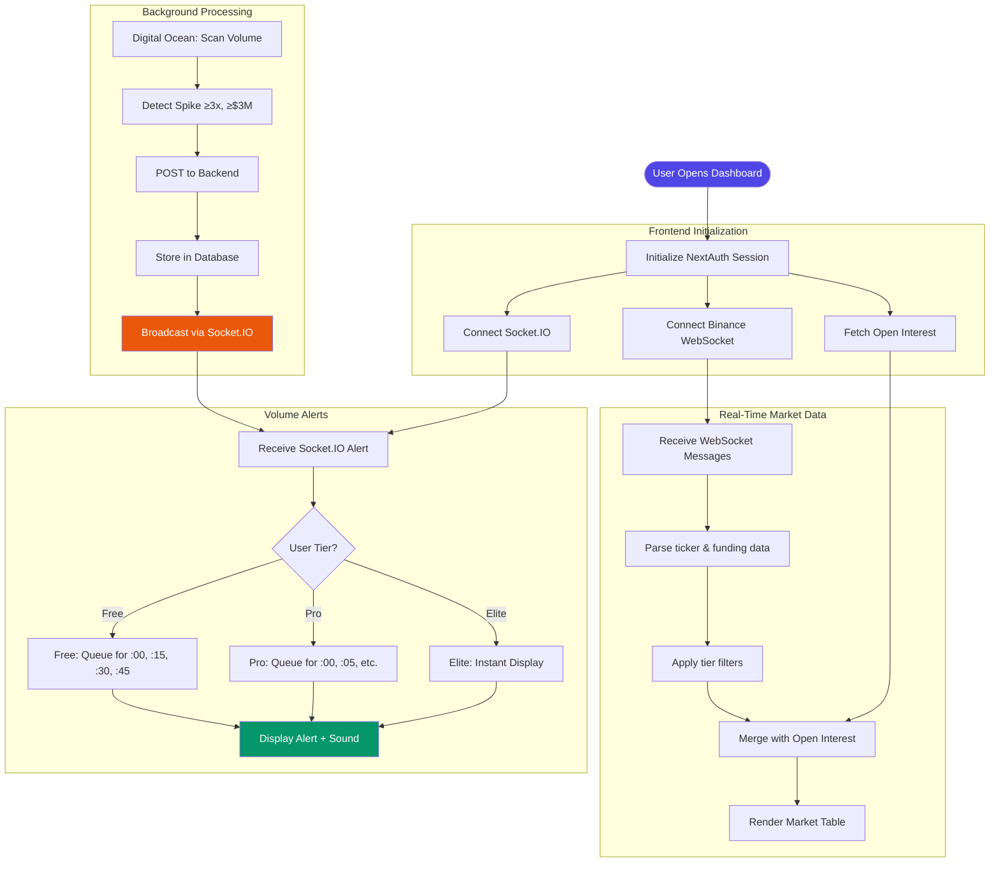

# VolSpike Architecture Diagram

This document contains Mermaid diagrams visualizing the VolSpike system architecture.

## System Overview



## Market Data Flow



## Volume Alerts Flow



## Authentication Flow



## Payment & Subscription Flow



## Tier-Based Features



## Database Schema Relationships



## Deployment Architecture



## Socket.IO Room Architecture

```mermaid
graph TB
    subgraph "Socket.IO Server"
        SERVER[Socket.IO Server<br/>In-Memory Adapter]
        
        subgraph "Tier-Based Rooms"
            ROOM_FREE[tier-free<br/>15-min batches]
            ROOM_PRO[tier-pro<br/>5-min batches]
            ROOM_ELITE[tier-elite<br/>Real-time]
        end
        
        subgraph "User Rooms"
            USER_ROOMS[user-{userId}<br/>Individual delivery]
        end
        
        subgraph "Symbol Rooms"
            SYMBOL_ROOMS[symbol-{symbol}<br/>Symbol subscriptions]
        end
    end
    
    subgraph "Alert Broadcasting"
        BROADCASTER[Alert Broadcaster Service]
        QUEUE_FREE[Free Queue<br/>:00, :15, :30, :45]
        QUEUE_PRO[Pro Queue<br/>:00, :05, :10, etc.]
    end
    
    subgraph "Clients"
        CLIENT_FREE[Free Tier Client]
        CLIENT_PRO[Pro Tier Client]
        CLIENT_ELITE[Elite Tier Client]
    end
    
    BROADCASTER -->|Instant| ROOM_ELITE
    BROADCASTER -->|Queue| QUEUE_PRO
    BROADCASTER -->|Queue| QUEUE_FREE
    
    QUEUE_PRO -->|Wall-clock sync| ROOM_PRO
    QUEUE_FREE -->|Wall-clock sync| ROOM_FREE
    
    ROOM_ELITE -->|Real-time| CLIENT_ELITE
    ROOM_PRO -->|Batched| CLIENT_PRO
    ROOM_FREE -->|Batched| CLIENT_FREE
    
    SERVER --> ROOM_FREE
    SERVER --> ROOM_PRO
    SERVER --> ROOM_ELITE
    SERVER --> USER_ROOMS
    SERVER --> SYMBOL_ROOMS
    
    style ROOM_ELITE fill:#f59e0b,color:#fff
    style ROOM_PRO fill:#3b82f6,color:#fff
    style ROOM_FREE fill:#94a3b8,color:#fff
```

## Complete System Data Flow



---

**Note:** These diagrams are best viewed in a Markdown viewer that supports Mermaid rendering (GitHub, GitLab, VS Code with Mermaid extension, etc.).

